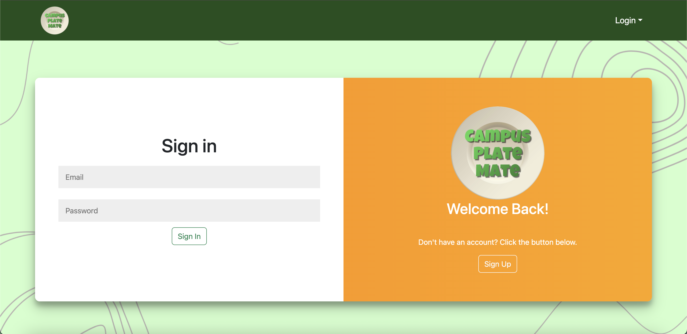
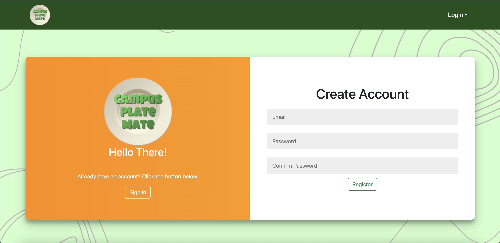
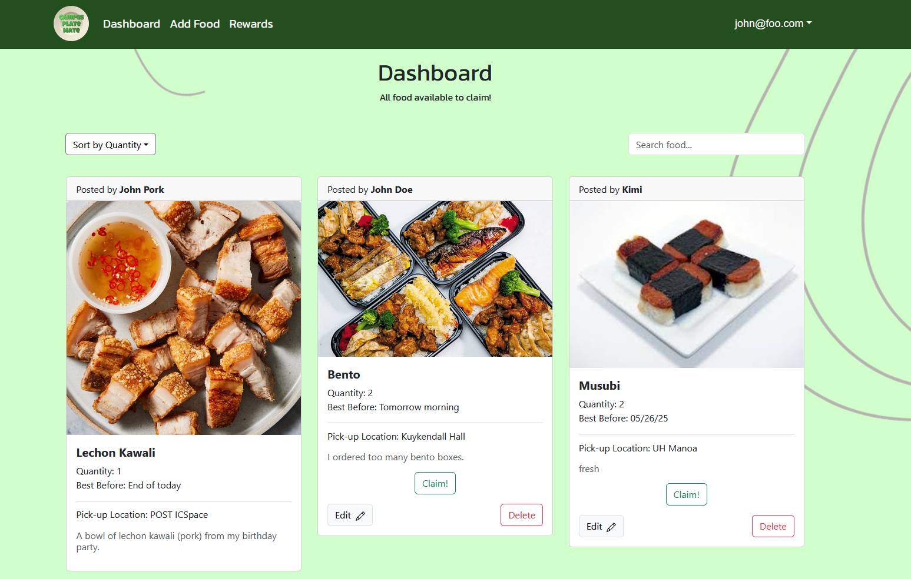

For the final project in my ICS 314 Software Engineering class taken in Spring 2025, five other people and I have developed a web application called "Campus Plate Mate". It is a platform where UH Manoa community members can give out their unwanted or excess food to other community members in need. The goal of Campus Plate Mate is to reduce food waste on the UH Manoa campus as it can be very prevalent, and we wanted to provide a platform where UH Manoa community members can interact with each other regarding their food or waste-reducing needs.

My biggest contributions to the project are the "Sign In/Up" page, where it acts as a slider form and you can choose whether you want to sign in or sign up (create an account), as well as the "Dashboard" page, where the posts by users are shown as cards. The slider form was requested by my fellow group mate and is from [here](https://codepen.io/FlorinPop17/pen/vPKWjd), while the Dashboard page reads from a database where it reads the posts created by users.

  Sign In/Up Slider
  
  
  
  

  Dashboard
  
  

One of the things I learned from this experience is that my group and I should have committed to the goals of each Milestone of the project. For example, Milestone 1 of the project should have taken care of most of the visual aspects of our web application, but we were still working on visuals during Milestone 2 and Milestone 3. Another thing I learned is that communication is really important in small-scale group projects like these. I noticed that when I saw my other group mates post about what they completed, I would then get a "drive" or "push" to reciprocate in the form of getting something done. Aside from this case, asking and answering questions is also vital because it builds a positive relationship within the group. If I saw a question, I would try my best to answer it or at least give ideas that can possibly lead to a solution. 

Overall, working on Campus Plate Mate taught me how to work in a group setting which will be valuable when entering the workforce.

Our [Organization Github Page](https://github.com/campusplatemate).
